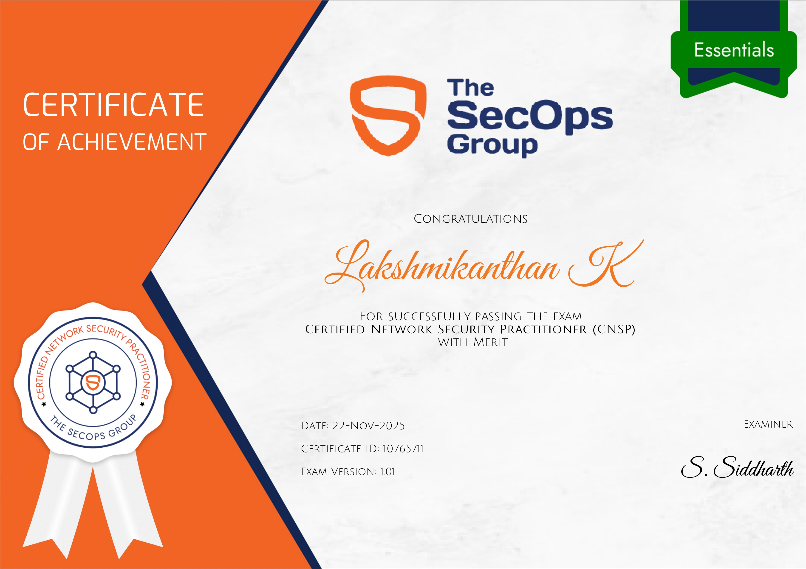

# CNSP Exam Study Guide

A comprehensive study guide and resource collection for the **Certified Network Security Practitioner (CNSP)** exam by The SecOps Group.

**Created by**: [Lakshmikanthan K](https://letchupkt.vgrow.tech) (letchupkt)  
**Connect**: [LinkedIn](https://linkedin.com/in/lakshmikanthank) | [Instagram](https://instagram.com/letchu_pkt) | [GitHub](https://github.com/letchupkt)

## 📋 Repository Contents

- [Exam Overview](docs/exam-overview.md) - Complete exam details and format
- [Study Materials](docs/study-materials.md) - Recommended resources and preparation path
- [Syllabus & Topics](docs/syllabus.md) - Detailed breakdown of exam domains
- [Practice Questions](docs/practice-questions.md) - 64 sample questions with answers
- [Quick Reference](docs/quick-reference.md) - Condensed cheat sheet for last-minute review
- [Passing & Certification](docs/certification.md) - Scoring, passing criteria, and certificate details
- [My Experience](docs/my-experience.md) - How I passed with 83% merit score
- [Author Profile](AUTHOR.md) - About Lakshmikanthan K (letchupkt)

## 🎯 Quick Facts

- **Exam Level**: Essentials (Entry to Intermediate)
- **Format**: Multiple Choice Questions (MCQ)
- **Duration**: 60 minutes
- **Passing Score**: 60% (75%+ for Merit)
- **Proctoring**: AI-proctored online exam
- **Cost**: Check [The SecOps Group website](https://thesecops.group) for current pricing
- **Validity**: Lifetime (no expiration)

## 🚀 Getting Started

1. Review the [Exam Overview](docs/exam-overview.md) to understand the format
2. Study the [Syllabus & Topics](docs/syllabus.md) systematically
3. Use the [Study Materials](docs/study-materials.md) guide to prepare
4. Practice with [Sample Questions](docs/practice-questions.md)
5. Read about [My Experience](docs/my-experience.md) for tips and insights
6. Check out the [Author Profile](AUTHOR.md) to learn more about my background

## 📚 Key Knowledge Areas

- TCP/IP & Networking Fundamentals
- Network Discovery & Scanning
- Active Directory & Windows Security
- Linux/Unix Security
- Cryptography & Authentication
- Network Services & Threat Mitigation

## ⚠️ Important Notes

- This is a **closed-book** exam
- Internet use during the exam is **strictly forbidden**
- Requires laptop with **camera and microphone** for AI proctoring
- Available **on-demand** after purchasing voucher

## 🤝 Contributing

Feel free to contribute by:
- Adding more practice questions
- Sharing study resources
- Improving documentation
- Reporting errors or outdated information

See [CONTRIBUTING.md](CONTRIBUTING.md) for guidelines.

## 👨‍💻 About the Author

**Lakshmikanthan K** is a cybersecurity enthusiast and AI/ML developer with expertise in:
- Penetration Testing & Bug Bounty Hunting
- Full-Stack Development (React, Node.js, Python)
- Machine Learning & AI Applications
- IoT & Hardware Development

**Certifications**:
- Certified Network Security Practitioner (CNSP) - 83% Merit ✅
- Certified Cybersecurity Educator Professional (CCEP) ✅
- Multiple industry certifications in cybersecurity and development

  
  
<em>CNSP Certificate - 83% Merit Pass</em>

**Connect**:
- Portfolio: [letchupkt.vgrow.tech](https://letchupkt.vgrow.tech)
- LinkedIn: [lakshmikanthank](https://linkedin.com/in/lakshmikanthank)
- GitHub: [letchupkt](https://github.com/letchupkt)
- Instagram: [@letchu_pkt](https://instagram.com/letchu_pkt)

## 📄 License

This study guide is provided for educational purposes under the MIT License. All exam content and trademarks belong to The SecOps Group.

---

**Disclaimer**: This is an unofficial study guide created by the community. Always refer to official SecOps Group materials for the most current exam information.
